# LDTS_T06_G07 - FROGGER

## Game Description

The objective of the game is to direct Mr. Frog to its home (the grass) across three different 
levels. The final destination is reached by crossing a busy road and navigating a river full 
of dangers while avoiding being run over or falling into the water, which would result in the 
loss of a life. The only player control is the 4-direction arrow keys on the keyboard, used to 
navigate the frog. Each click in one direction causes the frog to hop once in that same 
direction.

This game is based on the [classic Frogger game](https://www.free80sarcade.com/atari7800.php?cart=Froggie).

This project was developed by Anete Pereira (up202008856@edu.fe.up.pt), Isabel Amaral 
(up202006677@edu.fe.up.pt) and Mafalda Magalhães (up201707066@edu.fe.up.pt) for LDTS 2021-22.

## Game Images

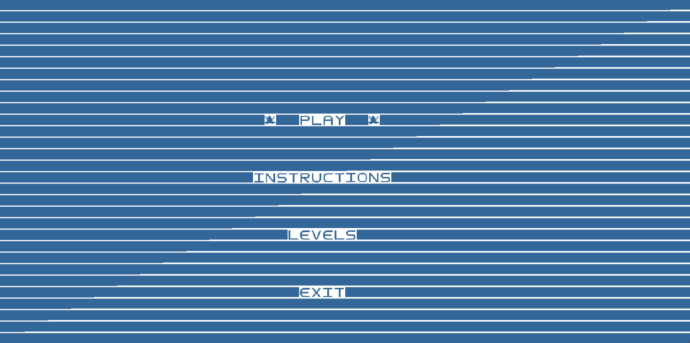

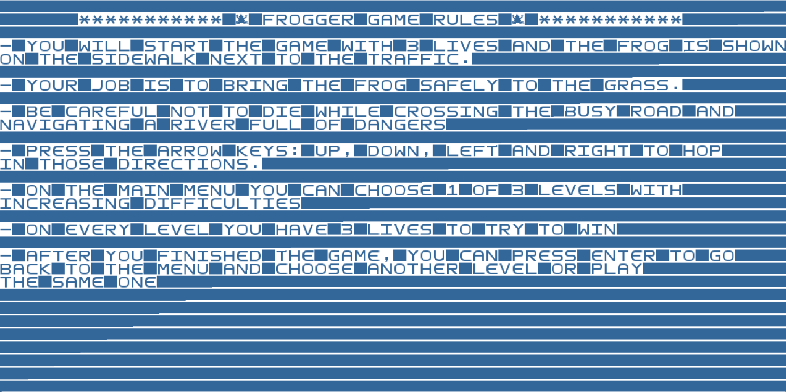

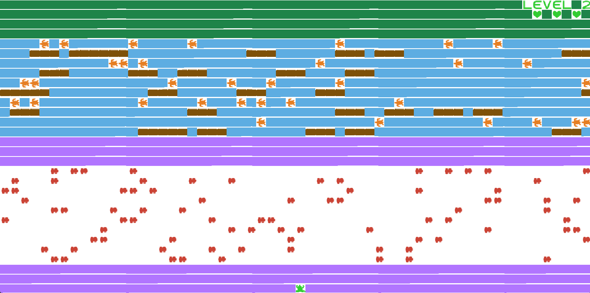

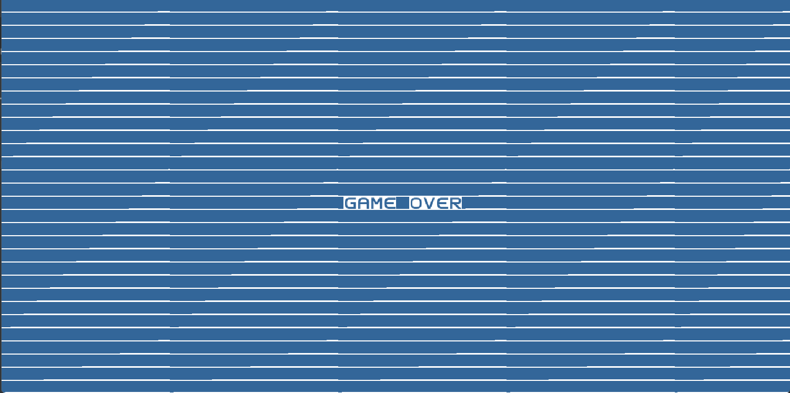

## Implemented Features

- **Keyboard Control** -The keyboard inputs are received through the respective events and 
interpreted according to the current game state.
- **Player control** - The player may move with the keyboard control.
 

- **Arena creation** - The arena is drawn in the Game class.
- **Elements creation** - All elements (movable and non-movable) are created at the beginning 
of the game. The creation of the movable game elements is done randomly and according to the 
current game level.
- **Collisions detection** - Collisions between the frog and the remaining elements (Car, 
Turtle, Water, TreeTrunk, Grass) are verified.
- **Different levels** - 3 different levels with an increasing difficulty (the velocity of
the cars, tree trunks and turtles will be higher and there will be more cars and less tree
trunks and turtles, making it more difficult to reach the grass).
 

- **Menu Buttons** - Functional and interactive buttons.
- **Connected Menus** - The user has the capability of browsing through the different menus. 
(Main Menu, Instructions, Play and Levels).
- **Animations** - Some cool animations are incorporated in this game, when you win or lose the game or when you lose a life.
- **Quit** - The key 'q' or 'Q' can be used at any time to close the game.
 

## Design

### Introduction

We began this project by doing some tests for the basic classes - Game and Arena. Then, we 
made a UML class diagram to help us understand better the structure of our game. Since our 
game is dealing with a GUI and is divided by different gameStates, we found three design 
patterns that would be able to fulfil the features to be implemented in our game.

The three main patterns that were applied to the project were the **Factory Method Pattern**, 
which is used to create the movable elements in our project, the **Command Pattern** which 
allows us to keep constantly moving cars, turtles and tree trunks either to the left or to 
the right and the **State Pattern**, which is a behavioral design pattern that lets an object 
alter its behavior as its internal state changes - in this case the four states are GameState
(the user is playing), MenuState (the user is in the Menu screen), WinState (the user won the
game) and the LoseState (the user lost the game). 

### UML Class Diagram

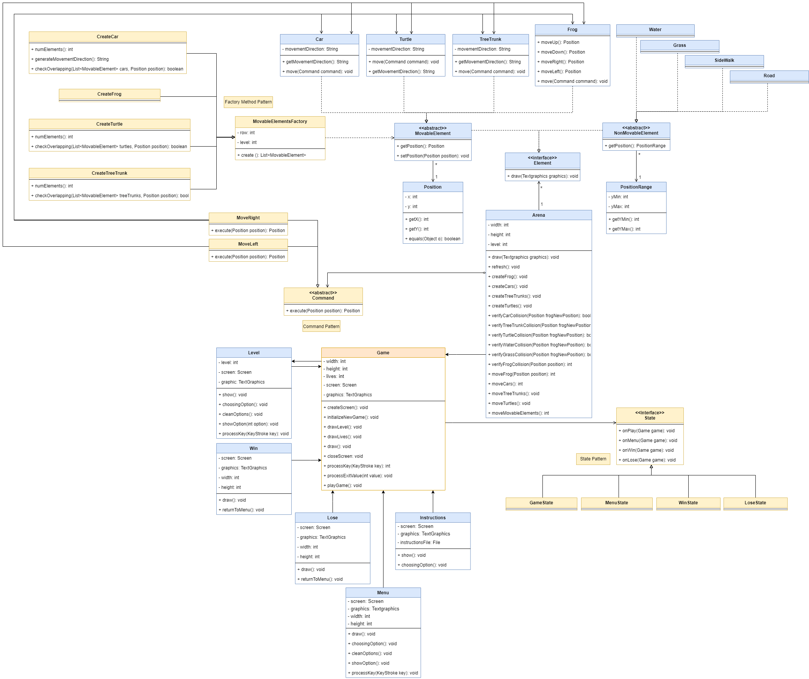

### Creation of Elements

#### Problem in Context:
Our game arena consists in a large agglomeration of movable elements such as cars, tree trunks
and turtles, as well as a single frog. Given the need of having different arenas with different
complexities in each one of the three levels, we found that having one single factory class 
(MovableElementsFactory) responsible for randomly creating the different instances of 
MovableElement objects according to the current game level, passed to this class as an attribute,
was an easier solution than just having a concrete creator for each level.

#### The Pattern:
The **Factory Method** is a creational design pattern that lets us create objets of a superclass,
while also allowing us to have subclasses to alter the type of objects that will be created.

#### Implementation:
Regarding the implementation, we now have classes which main purpose is to create new movable 
elements (CreateCar, CreateFrog, CreateTurtle and CreateTreeTrunk) based on the current level.

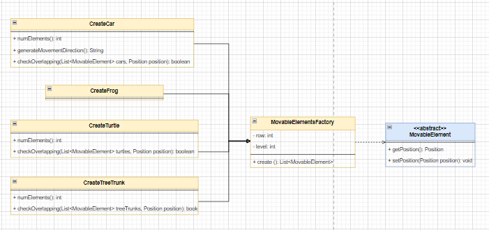

#### Consequences:
The use of this pattern in the current design allows the following benefits:
- The Factory Method separates product construction code from the code that actually uses the 
product, making it easier to extend the product construction independently of the latter.
- A well organized code that incorporates all the product creation code into one single place, 
making it easier to fix bugs and change whenever necessary.
- Easier to add new objects throughout the development stage, if needed.

### Two Different Types of Commands 
#### Problem in Context:
Most of our MovableElement objects (cars, tree trunks and turtles) will be in constant motion,
either to the left or to the right. This movement will be independent of the object's class. 
Whether the object is a Car, a TreeTrunk or a Turtle, it will always move either to the left 
or to the right, according to the traffic/river lane where it's located, and in a certain speed.

#### The Pattern:
We applied the **Command pattern**, which is a behavioral design pattern that turns a request 
into a stand-alone object that contains all information about said request. This means that 
an object is used to encapsulate all information needed to perform an action in the future 
(MoveRight and MoveLeft classes).

#### Implementation:
This pattern is implemented by having one single class, the Command class, with a single 
execution method (execute). Then, we have two classes, MoveLeft and MoveRight, that inherit 
this method, allowing us to overwrite it accordingly to our wishes. The MoveLeft class moves 
objects to the left and the MoveRight class moves them to the right.

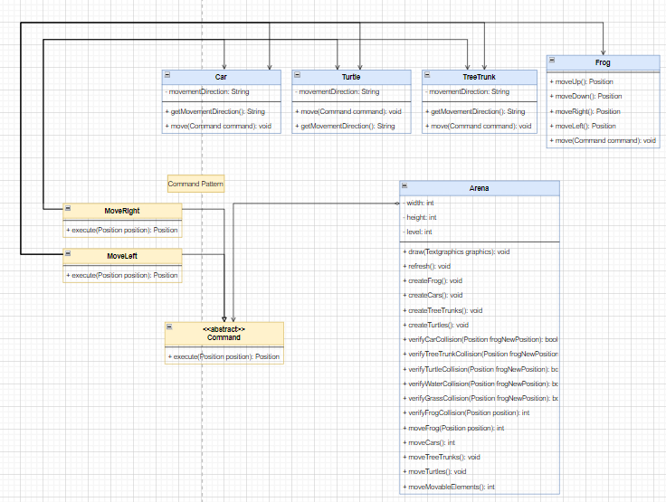

#### Consequences:
Some consequences of using the stated pattern:
- Promotes the Single Responsibility Principle, which means the Command class and its 
subclasses are the only ones accountable for moving the elements mentioned above since they 
share similar behaviour.
- Clean code.

### State of the Game
#### Problem in Context:
In our game we need to be able to change between the menu, the game itself, the 'victory' 
screen and the 'game over' screen. The easiest way to do this without duplicating code is 
to have a state attribute that allows us to know what we are supposed to be seeing or doing 
according to our current state in the game.

#### The Pattern:
The **State Pattern** allows us to keep state-specific behaviors by having subclasses for these
different states. It is a behavioral design pattern that lets an object alter its behavior when
its internal state changes, appearing as if the object has changed its class. 

#### Implementation:
A State class is responsible for keeping the current state of the game and its methods make 
it possible to change between the different states of our program - GameState, MenuState, 
WinState and LoseState.

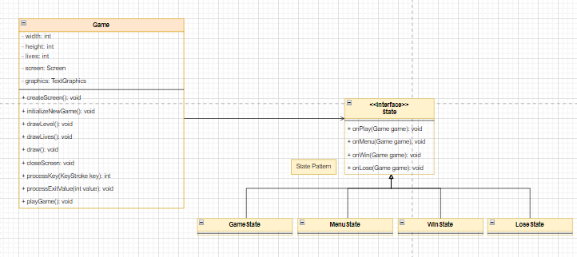

#### Consequences: 
The benefits of applying the above pattern are:
- Promotes the Single Responsibility Principle, since we can organize the code related to 
particular states into separate classes, without having to use switch clauses.
- Promotes the Open/Closed Principle, since we can introduce new states in the game without 
changing the existing state classes.
- Makes state transitions explicit.

## Known Code Smells And Refactoring Suggestions
#### Large Class
The class Arena contains many methods. In our opinion, we need to implement it this way because it is in this
class that most of the action occurs (Frog movement and collisions verification).
The overall structure of the code could have been improved if we had used the 
Model-View-Controller design pattern, since this would have allowed us to keep each one of 
our classes very focused on one specific task.

#### Refused Bequest
In an attempt to generalize and simplify our code, we created some abstract classes and some 
interfaces, resulting in the rising of the **Refused bequest** smell. As a result, some 
subclasses inherited methods from its parent classes which are neither defined nor used 
(ex: State subclasses).

#### Duplicated code
In some parts of the code we have some kind of similar logics being executed several times 
in different methods. For example, in the moveTurtles and moveTreeTrunks methods the code is 
similar and always performs the same job, but for different elements.

#### Switch Statements
We use instances of switch cases to handle Key Actions. However, we could not find an easier 
way to read the input given by the user and, int this case, the switch statement performs 
a very simple task.

## Testing

### Screenshot of coverage report

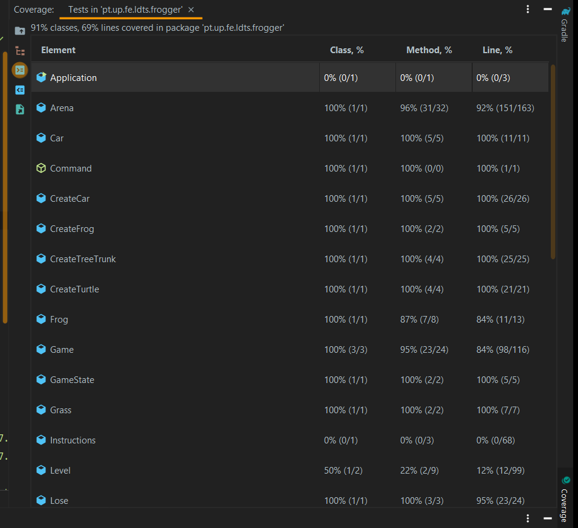

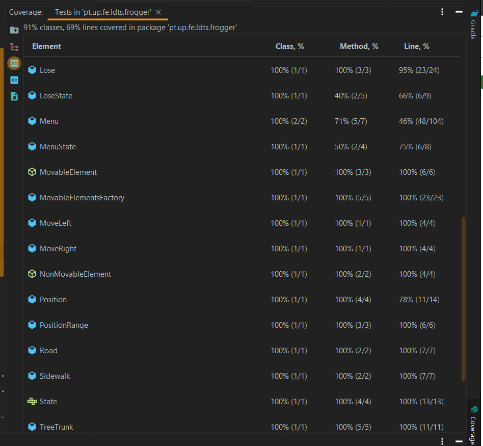

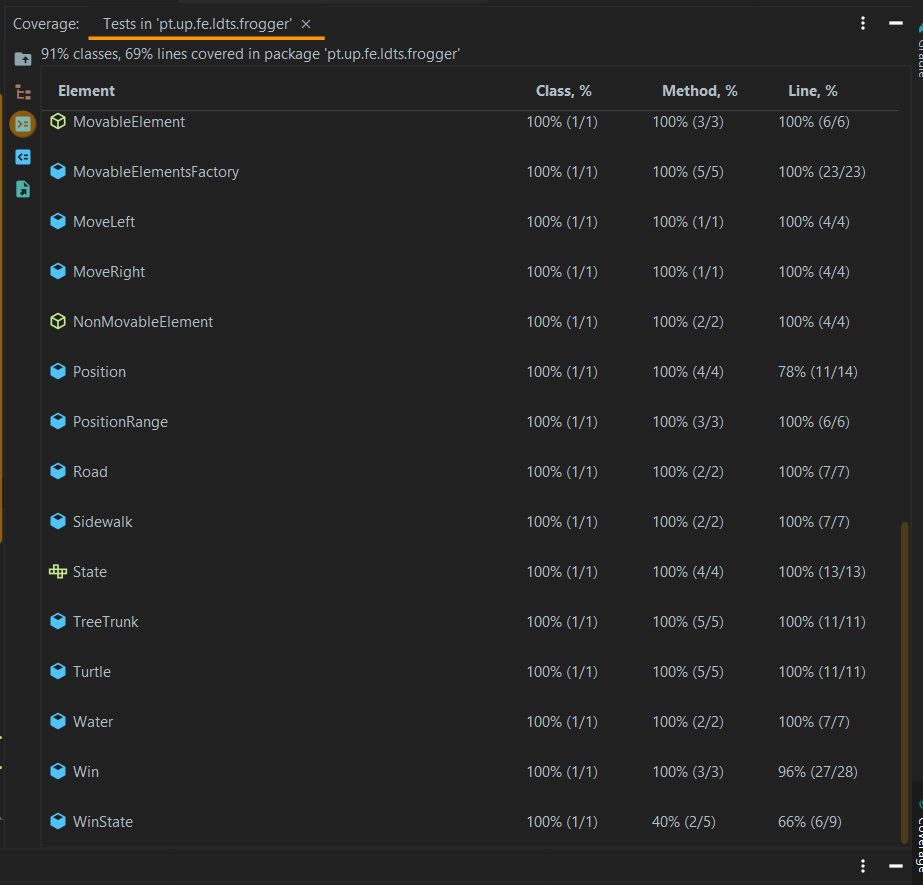

### Pitest

You can see the folder with the pitest report [here](https://github.com/FEUP-LDTS-2021/ldts-project-assignment-g0607/tree/master/build/reports/pitest/202201292224).  

## Self-evaluation
The work was divided equally between all the elements of the group. While some classes and 
tests were initially started by one of us, eventually everyone contributed to implementing 
some aditional methods, fixing bugs and errors and everyone was always available to help.

- Anete Pereira: 33.3%
- Isabel Amaral: 33.3%
- Mafalda Magalhães: 33.3%
